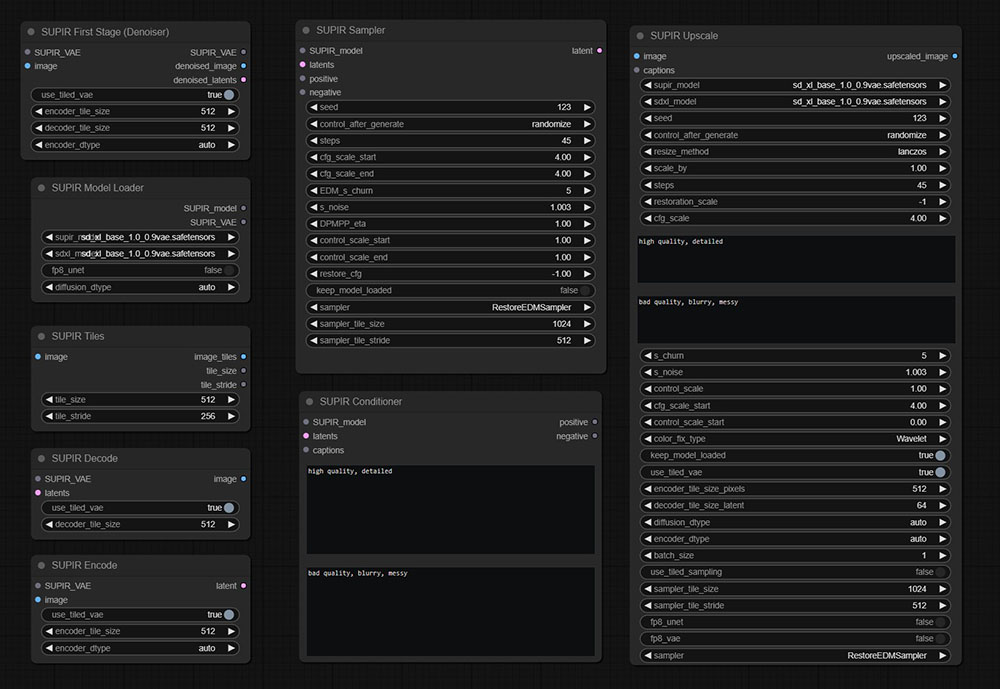

# ComfyUI-SUPIR-BAT
Surip updated to v.3
  _(only model files updated)_
  
Supir updated to v.2
  _(to examples added file supir_workflow_v2.json)_
  

---

Установочный BAT-файл для сборки "на лету" текущих git-версий "ComfyUI+SUPIR" для карт "NVIDIA".

> Installation BAT file for on-the-fly assembly of the current git versions of "ComfyUI+SUPER".

---

Этот пакет предназначен для автоматической установки "ComfyUI" и ноды апскейлера "SUPIR" с его моделями.

> This package is designed for automatic installation of "ComfyUI" and the "SUPER" upscale node with its models.

---

Я использую git-версии компонентов, при их обновлении что-то может поменяться.

> I use git versions of components, something may change when updating them.

---

Я использую git-версии компонентов, при их обновлении что-то может поменяться.

> I use git versions of components, something may change when updating them.

---

Идея сделать что-то "такое" появилась после того, как многие жаловались, что "Не удалось запустить!"...

> This package is designed for automatic installation of "ComfyUI" and the "SUPER" upscale node with its models. The idea to do something "like this" appeared after many complained that "It was not possible to launch!"...

---

Создайте пустой каталог (к примеру "c:\1") с скопируйте туда все файлы из архива.

> Create an empty directory (for example, "c:\1") and copy all files from the archive there.

---

Потом выполните команду: c:\1> git clone https://github.com/Nestorchik/ComfyUI-SUPIR-BAT.git

> Then run the command: c:\1> git clone https://github.com/Nestorchik/ComfyUI-SUPIR-BAT.git

---

Запуск инсталляции дистрибутива "ComfyUI+SUPIR+модели" файлом "install_supir.bat".

> Launching the installation of the "ComfyUI+SUPIR+models" distribution kit with the "install_super.bat" file.

---

Перед запуском измените значение переменной "python=c:\p31\python.exe" в файле "supir_install.bat" на реальное расположение питона 3.10 версии у вас! GIT-должен быть прописан в PATH!

> Before starting, change the value of the variable "python=c:\p31\python.exe" for the real location of python 3.10 version you have! GIT-must be registered in the PATH!

---

Для повторной инсталляции удалите полностью папку "ComfyUI" !!! (модели только сохраните, чтобы не качать повторно)

> To reinstall, completely delete the "ComfyUI" folder (only save the models so as not to download them again)

---

Установка и сборка происходит автоматически bat-файлом "supir_install.bat", в котором прописаны все команды для скачивания и инсталляции всего, что нужно для работы "SUPIR" под управлением "ComfyUI". Все пакеты питона, и модули скачиваются и копируются на свое место автоматически.

> Installation and assembly takes place automatically with the bat file "super_install.bat", which contains all the commands for downloading and installing everything that is needed for "SUPIR" to work under the control of "ComfyUI". All python packages and modules are downloaded and copied to their place automatically.

---

Исключение составляют модели "SUPIR", т.к. их скачивание занимает много времени. Строки скачивания моделей закомментированы как "ECHO", если хотите их скачивать вместе с установкой самого интерфейса, просто раскомментируйте строки, начинающиеся с "ECHO" (все остальные команды "echo" прописаны в нижнем регистре).

> The exception is the "SUPER" models, because downloading them takes a long time. The lines for downloading models are commented as "ECHO", if you want to download them together with the installation of the interface itself, just uncomment the lines starting with "ECHO" (all other "echo" commands are written in lowercase).

---

Приложен отдельный файл для скачивания моделей - "supir_models_download.bat". Поместите его рядом с файлом "supir_install.bat" и запустите отдельно, т.к. он учитывает структуру каталогов относительно своего расположения.

> Attached is a separate file for downloading models - "super_models_download.bat". Place it next to the file "sape_install.bat" and run it separately, because it takes into account the directory structure relative to its location.

---

Если у вас уже есть скачанные модели:

- SUPIR-v0F.ckpt <--- (для тестирования можете скачать только эту модель + sd_xl_base_1.0_0.9vae.safetensors)
- SUPIR-v0Q.ckpt
- sd_xl_base_1.0_0.9vae.safetensors

... то просто поместите их в папку "ComfyUI\models\checkpoints" т.к. нода "SUPIR_Upscale" будет искать их там!

UPD: (ссылки на модели v.3 в отдельном файле)

> If you already have downloaded models:

> - SUPER-v0.kt <--- (for testing, you can download only this model + sd_xl_base_1.0_0.9vae.safetensors)
> - SUPER-v 0Q.ckpt
> - sd_xl_base_1.0_0.9vae.safetensors

> ... then just put them in the folder "Config\models\checkpoints" because "SUPER_Upscale" will look for them there!

UPD: (links to models v.3 are in a separate file)
---

Результаты установки из этого bat-файла тестировались на приложенных файлах "example.jpg" и "supir_workflow_v1.json" (папка "examples"), результат представлен файлом "result.jpg" (папка "examples") и является результатом тестирования интерфейса, проведенного после установки этим инсталлятором. Время генерации на карте "NVIDIA GeForce RTX 2080 Ti (TU102)" и системной памяти 64Gb (процессор "Intel Core i9-9940X") составило 1396 секунд (scale_by=2).

> The installation results from this bat file were tested on the attached "example.jpg" and "super_workflow.json" (folder "examples"), the result is represented by the file "result.jpg" (folder "examples") and is the result of interface testing after installation by this installer. The generation time on the NVIDIA GeForce RTX 2080 Ti (TU 102) card and 64Gb system memory (Intel Core i9-9940X processor) was 1396 seconds (scale_by=2).

---

Постарайтесь соблюдать правила, описанные тут: https://t.me/stable_cascade_rus/47/751, приложенный файл "example.jpg" соответствует описанным там правилам, и тестирование проводилось именно на нем. Для ускорения генерации, можете понизить параметр "scale_by" до "1", если надо просто быстро проверить работоспособность сборки, в этом случае время генерации составит 55 секунд (у меня по крайней мере).

> Try to follow the rules described here: https://t.me/stable_cascade_rus/47/751 , the attached file is "example.jpg" corresponds to the rules described there, and testing was carried out on it. To speed up the generation, you can lower the "scale_by" parameter to "1" if you just need to quickly check the functionality of the assembly, in this case the generation time will be 55 seconds (at least for me).

---

Запуск браузера после старта сервера: http://127.0.0.1:8188

Запуск установленного интерфейса: "run_webui.bat"

---

> Launching the browser after the server starts: http://127.0.0.1:8188

> Launching the installed interface: "run_webui.bat"

---

После старта интерфейса загрузите в "ComfyUI" файл "supir_workflow_v1.json", а в ноду "Load Image" файл "example.jpg" (из папки "examples")для тестирования.

> After starting the interface, upload the "super_workflow.json" file to "ComfyUI", and the "example" file to the "Load Image" node (from the "examples" folder) for testing.

---

Удачи! )
Good luck!)
@srigert
https://t.me/stable_cascade_rus

---

P.S.

Надеюсь ни у кого не "поднимется язык" сказать, что это "плохая сборка", поскольку никакой "сборки" тут, по, факту просто нет.

> I hope no one will "raise their tongue" to say that this is a "bad build", since there is simply no "build" here.

---
